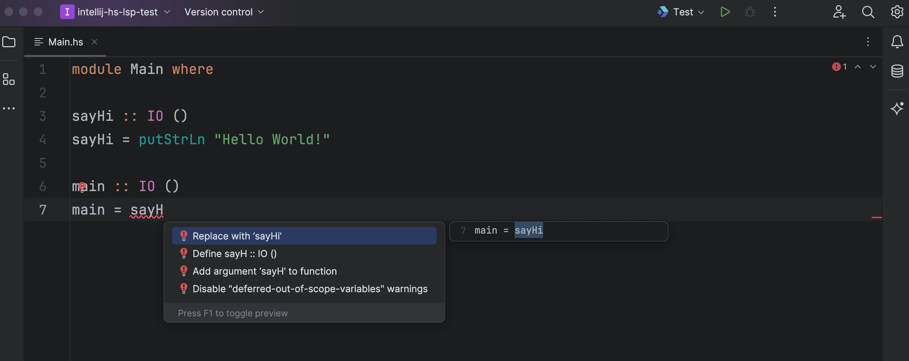

# Haskell LSP
Haskell LSP is a plugin that provides Haskell language support for IntelliJ IDEA

It uses the Haskell Language Server to provide features like code completion, go to definition, and more.

## Acknowledgements
Syntax Highlighting is loosely based around [intellij-haskell](https://github.com/rikvdkleij/intellij-haskell)'s Lexer/Parser and [The Haskell 98 Report](https://www.haskell.org/onlinereport/syntax-iso.html).